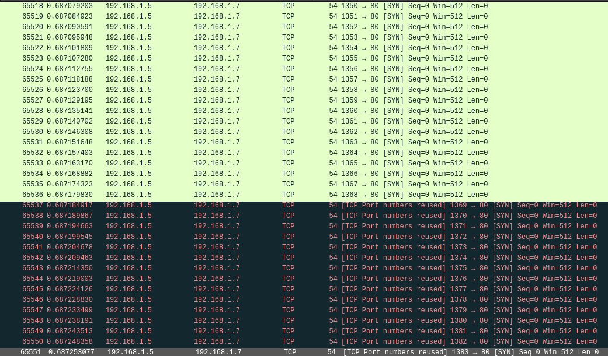
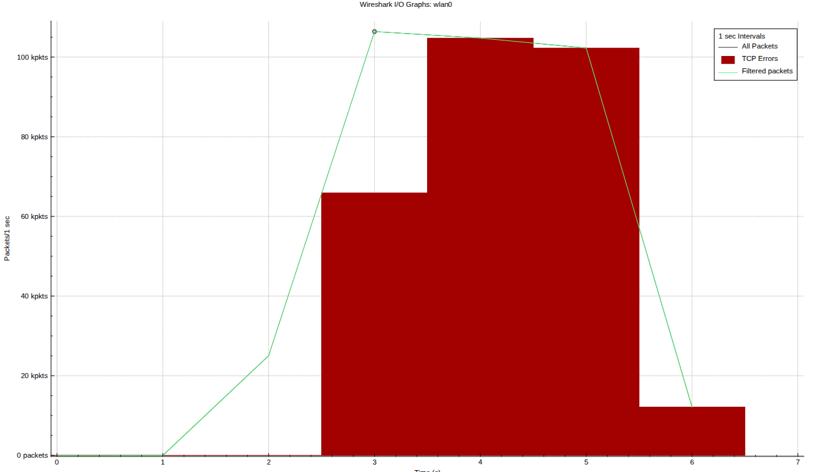
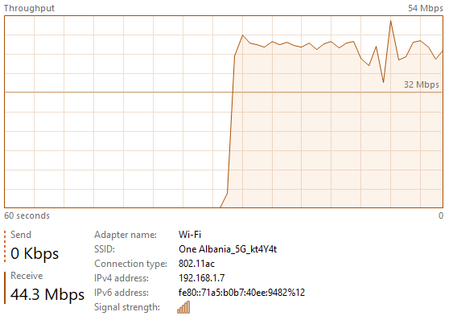
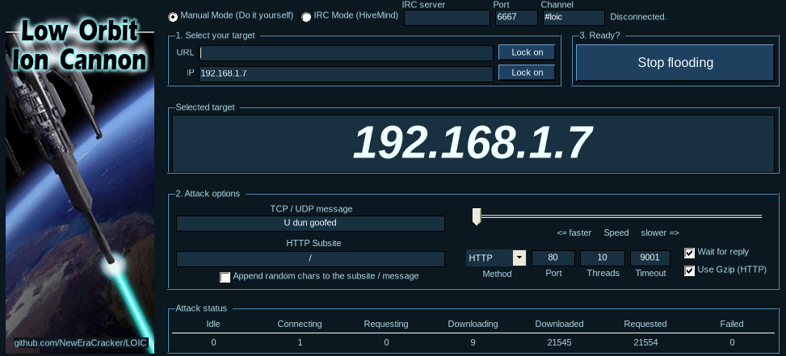

# Dokumentim i Detyrës: Gjenerimi dhe Analiza e Trafikut Volumetrik në një Rrjet të Simuluar

## Përmbledhje

Ky punim paraqet hulumtimin, realizimin praktik dhe analizën e një skenari të kontrolluar të gjenerimit të trafikut volumetrik ndaj një njësie kompjuterike në një rrjet të simuluar. Eksperimenti është zhvilluar në një mjedis lokal dhe të izoluar, ku një makinë fizike me Linux është përdorur për gjenerimin e trafikut (si sulmues), ndërsa një makinë me Windows është përdorur si objektiv i testimit.

Për të përmbushur kërkesën e detyrës për aplikimin e të paktën 2 alternativave të ndryshme, u testuan dy shtresa të ndryshme sulmesh volumetrike:

1. Trafik volumetrik në nivelin e rrjetit (Layer 4 TCP SYN Flood) duke përdorur `hping3`.

2. Trafik volumetrik në nivelin e aplikacionit (Layer 7 HTTP Flood) duke përdorur `LOIC`.

## Objektivat e këtij punimi janë:

- Të studiohen alternativat e mundshme për gjenerimin e trafikut volumetrik.

- Të realizohet të paktën një skenar praktik i gjenerimit të trafikut në një rrjet të simuluar (me dy alternativa të ndryshme).

- Të analizohet ekzekutimi i trafikut ndaj hostit objektiv.

- Të paraqiten masa mbrojtëse ndaj këtij trafiku.

- Të dokumentohet në mënyrë të qartë pjesa ofensive dhe mbrojtëse.

### Komponentët e mjedisit

- **Makina fizike (sulmues / analizues)**:
  - Sistem operativ: Linux

  - Roli: Gjenerim trafiku me hping3 dhe LOIC, monitorim me Wireshark

  - Adresa IP: 192.168.1.5

- **Makina objektiv**:
  - Sistem operativ: Windows

  - Shërbimet: Web Server XAMPP (Apache)

  - Roli: Host objektiv ndaj të cilit drejtohet trafiku

  - Adresa IP: 192.168.1.7

- **Rrjeti**:
  - Rrjet lokal i izoluar

## Metodologjia e punës

Metodologjia e ndjekur gjatë realizimit të eksperimentit është ndarë në këto hapa:

1. Përgatitja e mjedisit dhe identifikimi i IP-ve

2. Verifikimi i lidhjes mes hosteve

3. **Eksperimenti 1**: Gjenerimi i trafikut me `hping3` (Layer 4), analiza dhe zbatimi i masave mbrojtëse.

4. **Eksperimenti 2**: Gjenerimi i trafikut me `LOIC` (Layer 7), analiza dhe zbatimi i masave mbrojtëse.

## Puna Praktike

### 1. Përgatitja e hosteve

Fillimisht u identifikuan adresat IP të të dy sistemeve. Në makinën Windows u përdor komanda `ipconfig` për të verifikuar adresën IPv4, ndërsa në Linux u përdor `ip a`.

### 2. Verifikimi i lidhjes

Përpara gjenerimit të trafikut u testua komunikimi bazë mes dy paisjeve. Kjo u realizua për të siguruar që se paketat mund të kalonin normalisht para fillimit të testit. Në makinën Windows ishte e nevojshme të që të ndizeshin disa firewall rules(`File and Printer Sharing(Echo Request)`), që të mund të merrte thirjet nga komanda `ping`.

```bash
ping 192.168.1.7
```

Rezultati i komandës

```bash
PING 192.168.1.7 (192.168.1.7) 56(84) bytes of data.
64 bytes from 192.168.1.7: icmp_seq=1 ttl=128 time=4.09 ms
64 bytes from 192.168.1.7: icmp_seq=2 ttl=128 time=5.23 ms
64 bytes from 192.168.1.7: icmp_seq=3 ttl=128 time=5.41 ms
64 bytes from 192.168.1.7: icmp_seq=4 ttl=128 time=5.64 ms
^C
--- 192.168.1.7 ping statistics ---
4 packets transmitted, 4 received, 0% packet loss, time 3007ms
rtt min/avg/max/mdev = 4.094/5.093/5.642/0.595 ms
```

---

## Eksperimenti 1: Gjenerimi i trafikut me `hping3`

Për pjesën e parë praktike u përdor `hping3` në makinën Linux. Ky mjet u zgjodh sepse vjen si paketë e gatshme në shumicën e distrove Linux dhe lejon kontroll të saktë teknik mbi llojet e paketave.
​

### Gjenerimi i trafikut testues

Në fazën ofensive u përdor `hping3` për të krijuar trafik `TCP` `SYN` drejt Windows-it. Në këtë mënyrë u simulua një fluks i madh kërkesash fillestare lidhjeje ndaj hostit objektiv, me qëllim vëzhgimin e ndikimit të tij në rrjet.
​

### Komanda e përdorur:

```bash
sudo hping3 -S -p 80 --flood 192.168.1.7
```

Shpjegimi i komandës:

- `-S` përdoret për të vendosur `TCP` `SYN` flag në paketat e dërguara.

- `-p 80` tregon që trafiku drejtohet te porta `80` të hostit objektiv.

- `--flood` bën dërgimin e paketave me ritëm shumë të lartë, pa pritur përgjigje mes paketave të njëpasnjëshme.

Ky konfigurim krijon trafik volumetrik të qartë dhe të lehtë për t’u vëzhguar në `Wireshark`.

Në Linux u hap `Wireshark` për të kapur paketat, duke përdorur filtrin: `tcp.flags.syn == 1 and tcp.flags.ack == 0`.



_Trafiku që u kap nga Wireshark gjatë ekzekutimit të komandës hping3_



Siç shihet kemi një numër të madh paketash që dërgohen. Shifet që disa paketa janë me ngjyrë jeshile dhe disa të tjera jo, kjo sepse në pak sekonda dërgohen paketa më shumë se sa numri i portave, prandaj merret errori `TCP port numbers reused`.


_Në Task Manager të makinës Windows u vu re menjëherë një trafik voluminoz në hyrje_

### Analiza e ekzekutimit dhe Interpretimi Teknik

Në një lidhje `TCP` normale, komunikimi fillon përmes procesit `three-way handshake`. Gjatë ekzekutimit të komandës, u vërejt një rritje e menjëhershme e trafikut. Siç shihet në `Wireshark`, kemi një numër të madh paketash `SYN` që dërgohen.
​
U vu re se brenda pak sekondave u dërguan më shumë paketa sesa numri total i portave, duke gjeneruar errorin: `TCP port numbers reused`. Kjo ndodh kur portat rikthehen në fillim dhe ripërdoren për shkak të ngarkesës ekstreme të volumit.
Hosti objektiv shfaqi ngarkesë të lartë gjatë trajtimit të këtyre lidhjeve gjysmë të hapura (half-open connections).

### Masat mbrojtëse për `hping3`

Për të mbrojtur hostin nga ky trafik i nivelit 4, u konfigurua një rregull në Windows Defender Firewall për të bllokuar trafikun hyrës nga adresa IP `192.168.1.5`. Pas aplikimit të rregullit Windows bëri drop paketat menjëherë në nivelin e sistemit operativ, duke mbrojtur serverin.

---

## Eksperimenti 2: Gjenerimi i trafiku HTTP me `LOIC`

Për të ofruar një alternativë të dytë të trafikut volumetrik, u zgjodh programi `LOIC` (Low Orbit Ion Cannon). Ndryshe nga `hping3` që fokusohet në lidhjet `TCP`, `LOIC` u përdor për të gjeneruar `HTTP Flood`. Ky lloj sulmi ndodh në nivelin e aplikacionit (Layer 7) dhe është më i vështirë për t'u bllokuar nga firewall-et tradicionale, pasi kërkesat duken legjitime.

Për të bërë testimin, në makinën Windows u aktivizua shërbimi `Apache` nëpërmjet panelit `XAMPP`, i cili filloi të dëgjonte në portin `80` për kërkesa web.

### Gjenerimi i trafikut testues

Në ndërfaqen e LOIC, u caktua IP e Windows (`192.168.1.7`), dhe si metodë sulmi u zgjodh `HTTP` me një numër të madh threads, për të krijuar vëllim të lartë.

Kur filloi sulmi, `LOIC` krijoi lidhje të plota `TCP` dhe i dërgoi serverit `Apache` një numër kolosal kërkesash të njëpasnjëshme `GET` / `HTTP/1.1`.



_Paraqitja e ndërfaqes grafike të LOIC gjatë ekzekutimit të metodës HTTP_


_Grafiku i CPU/RAM gjatë ngarkesës së XAMPP_

### Analiza e ekzekutimit

Gjatë kësaj faze u vu re një sjellje komplet e ndryshme nga ajo e `hping3`:

1. `Përgjigjet e plota të Serverit`: Gjatë ekzekutimit, serveri `XAMPP` u detyrua të procesonte çdo kërkesë dhe t'i kthente përgjigje (`200 OK`).

2. `Konsumi i Resurseve`: Ndërkohë që `hping3` mbushi bandwidth, `LOIC` konsumoi shpejt CPU-në dhe RAM-in e kompjuterit objektiv, për shkak se procesi `xampp-control.exe` (`httpd.exe`) u detyrua të përpunonte hapjen e mijëra lidhjeve të aplikacionit.
   ​

### Masat mbrojtëse për HTTP Flood (LOIC)

Për shkak se një sulm në Layer 7 kalon pa problem përmes Windows Firewall (pasi porta `80` duhet të qëndrojë e hapur për kërkesat legjitime), u aplikua një masë mbrojtëse direkte në Web Server-in Apache.
Në skedarin e konfigurimit të XAMPP, `httpd.conf`, u aktivizua dhe u konfigurua moduli i vonesave dhe kufizimeve të kërkesave (Rate Limiting).

```text
httpd.conf

LoadModule reqtimeout_module modules/mod_reqtimeout.so
```

Më pas, në fund të skedarit, u shtua ky bllok kodi që përcakton rregullat e kufizimit të kohës dhe të sasisë së të dhënave (Rate Limiting) për çdo klient.

```text
<IfModule mod_reqtimeout.c>
    RequestReadTimeout header=20-40,MinRate=500 body=20,MinRate=500
</IfModule>
```

Kur `LOIC` ose mjete të tjera hapin lidhje dhe përpiqen t'i mbajnë ato hapur pa dërguar të dhëna mjaftueshëm shpejt (ose duke dërguar kërkesa mbytëse radhazi), moduli `mod_reqtimeout` i identifikon këto si anomali dhe e detyron serverin Apache të ndërpresë lidhjen duke kthyer një error `408 REQUEST TIMEOUT`. Kjo zgjidh menjëherë mbingarkesën e CPU-së dhe memories.

## Përfundime dhe Kufizimet e eksperimentit

Përmes ekzekutimit të këtyre dy alternativave të ndryshme, u vërtetua qartë ndikimi që ka trafiku volumetrik ndaj një njësie kompjuterike në rrjet. Alternativa 1 `hping3` sulmoi `network layer` duke ndërprerë kërkesat për `three-way handshake`, ndërsa Alternativa 2 `LOIC` theksoi rrezikun që shfaqej nga sulmet në Layer 7.

Ky test është zhvilluar në një mjedis të kufizuar laboratorik dhe nuk përfaqëson kompleksitetin e plotë të një sulmi volumetrik në rrjete reale. Në një ambient real, faktorë si pajisjet ndërmjetëse, kapaciteti i rrjetit (bandwidth i ofruesit të internetit), shumëllojshmëria e burimeve të trafikut dhe mekanizmat profesionalë të mbrojtjes (p.sh. Cloudflare, IDS/IPS në nivel rrjeti) do të ndikonin ndjeshëm në rezultat.
